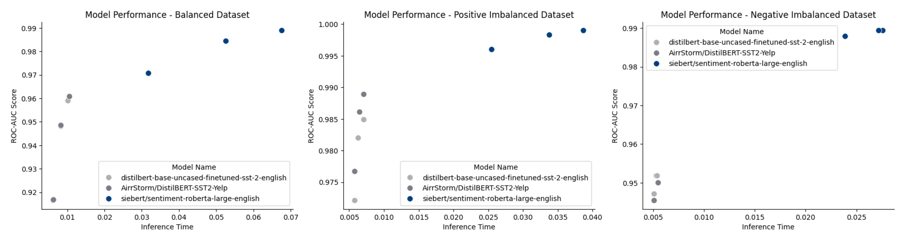

# Project Overview
This project deploys a Large Language Model (LLM) for technology news classification. News articles are collected daily via Apache Airflow, classified using an LLM, and the results are stored in a PostgreSQL database. Model tracking is handled via MLflow.

## Model and Hyperparameter Selection
Three different text classification models, each with varying maximum token lengths, were evaluated using the IMDB, Amazon, and mixed reviews datasets. Based on classification performance (Accuracy and ROC-AUC scores) and average response time, the most efficient model was selected: "siebert/sentiment-roberta-large-english" (`max_length = 128`).




Also detailed experiment results are available in `model_selection/model_logs.csv`.

## Project Architecture
Airflow DAG --> LLM Model Inference --> Postgres Logging --> MLflow Tracking

1. Airflow is used for daily news collection. You can trigger the dag manually as well.
2. The model classifies the news as it receives it. The labels are positive (1) and negative (0).
3. The news, the topic and the classification results are logged in a Postgres database.
4. During the process, the model specs like response time, device it used, the label tracked in a MLFlow Server.

## Setup Instructions

```bash
git clone https://github.com/egonos/News-Classification.git
cd News-Classification
docker compose up --build -d
```
To run with GPU support:

```bash
docker compose --compatibility up --build -d
```

## Usage

Interface links:

* Airflow UI: `http://localhost:8080` (User name: egemen, Password: egemen)
* MLFlow UI: `http://localhost:5000`

Configure and Trigger Dag:

* Dag name: `news_classification_dag`
* Triggered daily but it could be also triggered manually.

To view the results table (after running the algorithm), you can download and use DBeaver:

* Click Database
* Select `New Database Connection`
* Select `postgres`
* Database: `airflow`, username: `airflow`, password: `airflow`


## Further Improvements
The models were evaluated using review datasets. More relevant data could be used for fine-tuning the LLM model, which would improve its performance.
